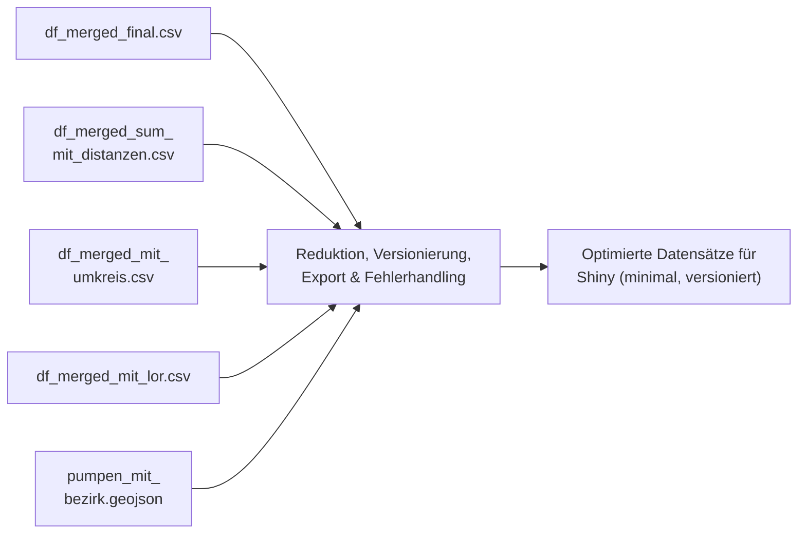

```mermaid
flowchart LR
    R1["df_merged_final.csv"]
    R4["df_merged_sum_<br>mit_distanzen.csv"]
    R5["df_merged_mit_<br>umkreis.csv"]
    R7["df_merged_mit_lor.csv"]
    R3["pumpen_mit_<br>bezirk.geojson"]

    V11["Reduktion, Versionierung,<br>Export & Fehlerhandling"]

    Final["Optimierte Datensätze für<br> Shiny (minimal, versioniert)"]

    R1 --> V11
    R4 --> V11
    R5 --> V11
    R7 --> V11
    R3 --> V11 --> Final
```