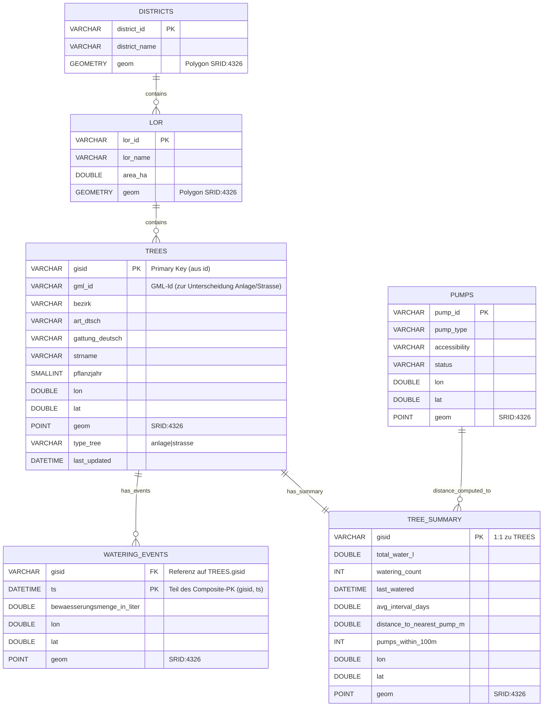

```mermaid
erDiagram
    TREES {
        VARCHAR gisid PK "Primary Key (aus id)"
        VARCHAR gml_id "GML-Id (zur Unterscheidung Anlage/Strasse)"
        VARCHAR bezirk
        VARCHAR art_dtsch
        VARCHAR gattung_deutsch
        VARCHAR strname
        SMALLINT pflanzjahr
        DOUBLE lon
        DOUBLE lat
        POINT geom "SRID:4326"
        VARCHAR type_tree "anlage|strasse"
        DATETIME last_updated
    }

    WATERING_EVENTS {
        VARCHAR gisid FK "Referenz auf TREES.gisid"
        DATETIME ts PK "Teil des Composite-PK (gisid, ts)"
        DOUBLE bewaesserungsmenge_in_liter
        DOUBLE lon
        DOUBLE lat
        POINT geom "SRID:4326"
    }

    TREE_SUMMARY {
        VARCHAR gisid PK "1:1 zu TREES"
        DOUBLE total_water_l
        INT watering_count
        DATETIME last_watered
        DOUBLE avg_interval_days
        DOUBLE distance_to_nearest_pump_m
        INT pumps_within_100m
        DOUBLE lon
        DOUBLE lat
        POINT geom "SRID:4326"
    }

    PUMPS {
        VARCHAR pump_id PK
        VARCHAR pump_type
        VARCHAR accessibility
        VARCHAR status
        DOUBLE lon
        DOUBLE lat
        POINT geom "SRID:4326"
    }

    LOR {
        VARCHAR lor_id PK
        VARCHAR lor_name
        DOUBLE area_ha
        GEOMETRY geom "Polygon SRID:4326"
    }

    DISTRICTS {
        VARCHAR district_id PK
        VARCHAR district_name
        GEOMETRY geom "Polygon SRID:4326"
    }

    %% Beziehungen
    TREES ||--o{ WATERING_EVENTS : "has_events"
    TREES ||--|| TREE_SUMMARY : "has_summary"
    LOR ||--o{ TREES : "contains"
    DISTRICTS ||--o{ LOR : "contains"
    PUMPS ||--o{ TREE_SUMMARY : "distance_computed_to" 
    %% (räumliche Beziehungen sind NICHT-FK in DB; "distance_computed_to" steht für gespeicherte Distanzen)
```