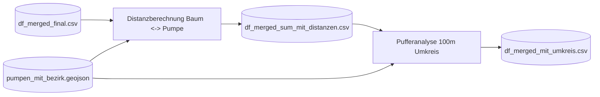

```mermaid
flowchart LR
    R1[(df_merged_final.csv)]
    R3[(pumpen_mit_bezirk.geojson)]

    V5["Distanzberechnung Baum  <-> Pumpe"]
    V6["Pufferanalyse 100m Umkreis"]

    R4[(df_merged_sum_mit_distanzen.csv)]
    R5[(df_merged_mit_umkreis.csv)]

    R1 --> V5
    R3 --> V5 --> R4

    R4 --> V6
    R3 --> V6 --> R5
```