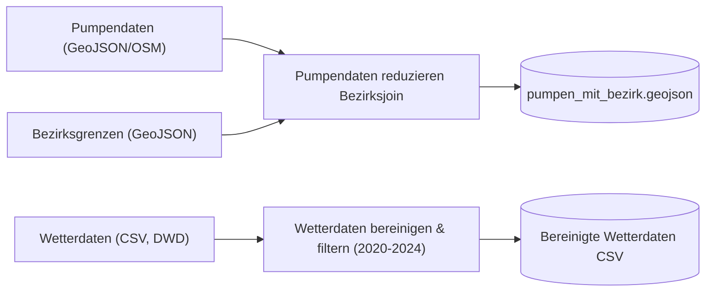

```mermaid
flowchart LR
    C["Pumpendaten (GeoJSON/OSM)"]
    D["Wetterdaten (CSV, DWD)"]
    E["Bezirksgrenzen (GeoJSON)"]

    V4["Pumpendaten reduzieren Bezirksjoin"]
    V7["Wetterdaten bereinigen & filtern (2020-2024)"]

    R3[(pumpen_mit_bezirk.geojson)] 
    R6[(Bereinigte Wetterdaten CSV)]

    C --> V4
    E --> V4 --> R3

    D --> V7 --> R6
```