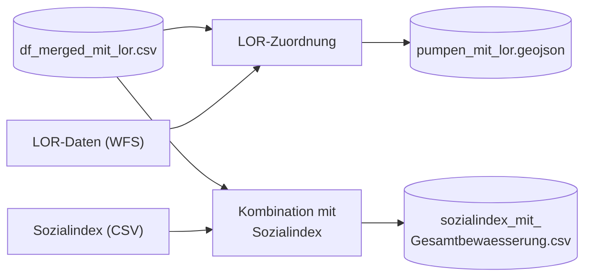

```mermaid
flowchart LR
    R7[(df_merged_mit_lor.csv)]
    F["LOR-Daten (WFS)"]
    G["Sozialindex (CSV)"]

    V9["LOR-Zuordnung"]
    V10["Kombination mit <br> Sozialindex"]

    R8[(pumpen_mit_lor.geojson)]
    R9[(sozialindex_mit_<br>Gesamtbewaesserung.csv)]

    R7 --> V9
    F --> V9 --> R8

    R7 --> V10
    G --> V10 --> R9
```