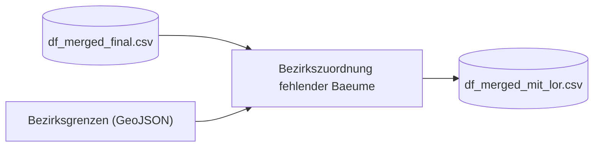

```mermaid
flowchart LR
    R1[(df_merged_final.csv)]
    E["Bezirksgrenzen (GeoJSON)"]

    V8["Bezirkszuordnung fehlender Baeume"]

    R7[(df_merged_mit_lor.csv)]

    R1 --> V8
    E --> V8 --> R7
```
