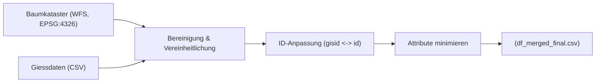

```mermaid
flowchart LR
    A["Baumkataster (WFS, EPSG:4326)"]
    B["Giessdaten (CSV)"]

    V1["Bereinigung & Vereinheitlichung"]
    V2["ID-Anpassung (gisid <-> id)"]
    V3["Attribute minimieren"]

    R1["(df_merged_final.csv)"]

    A --> V1
    B --> V1 --> V2 --> V3 --> R1
```