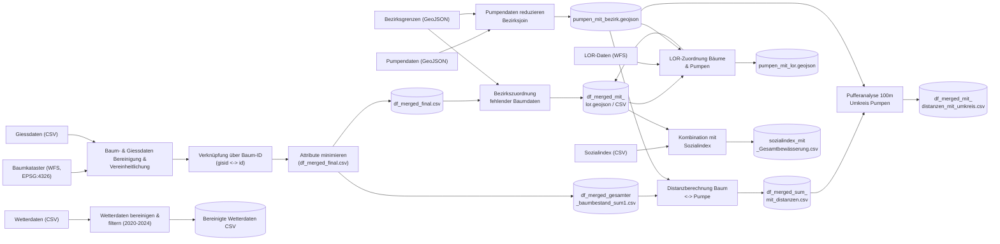

```mermaid
flowchart LR
    %% Datenquellen
    A["Baumkataster (WFS, <br>EPSG:4326)"]
    B["Giessdaten (CSV)"]
    C["Pumpendaten (GeoJSON)"]
    D["Wetterdaten (CSV)"]
    E["Bezirksgrenzen (GeoJSON)"]
    F["LOR-Daten (WFS)"]
    G["Sozialindex (CSV)"]

    %% Verarbeitungsschritte
    V1["Baum- & Giessdaten <br> Bereinigung & Vereinheitlichung"]
    V2["Verknüpfung über Baum-ID <br> (gisid <-> id)"]
    V3["Attribute minimieren <br> (df_merged_final.csv)"]
    V4["Pumpendaten reduzieren <br> Bezirksjoin"]
    V5["Distanzberechnung Baum<br> <-> Pumpe"]
    V6["Pufferanalyse 100m <br>Umkreis Pumpen"]
    V7["Wetterdaten bereinigen & <br>filtern (2020-2024)"]
    V8["Bezirkszuordnung<br> fehlender Baumdaten"]
    V9["LOR-Zuordnung Bäume<br> & Pumpen"]
    V10["Kombination mit<br> Sozialindex"]

    %% Ergebnisse
    R1[(df_merged_final.csv)]
    R2[(df_merged_gesamter<br>_baumbestand_sum1.csv)]
    R3[(pumpen_mit_bezirk.geojson)]
    R4[(df_merged_sum_<br>mit_distanzen.csv)]
    R5[(df_merged_mit_<br>distanzen_mit_umkreis.csv)]
    R6[(Bereinigte Wetterdaten CSV)]
    R7[(df_merged_mit_<br>lor.geojson / CSV)]
    R8[(pumpen_mit_lor.geojson)]
    R9[(sozialindex_mit<br>_Gesamtbewässerung.csv)]

    %% Verbindungen
    A --> V1
    B --> V1
    V1 --> V2 --> V3 --> R1
    V3 --> R2

    C --> V4
    E --> V4
    V4 --> R3

    R2 --> V5
    R3 --> V5 --> R4

    R4 --> V6
    R3 --> V6 --> R5

    D --> V7 --> R6

    R1 --> V8
    E --> V8 --> R7

    R7 --> V9
    F --> V9
    R3 --> V9
    V9 --> R8
    V9 --> R7

    G --> V10
    R7 --> V10 --> R9
```